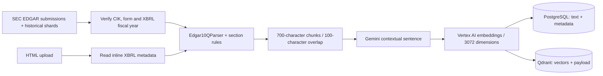
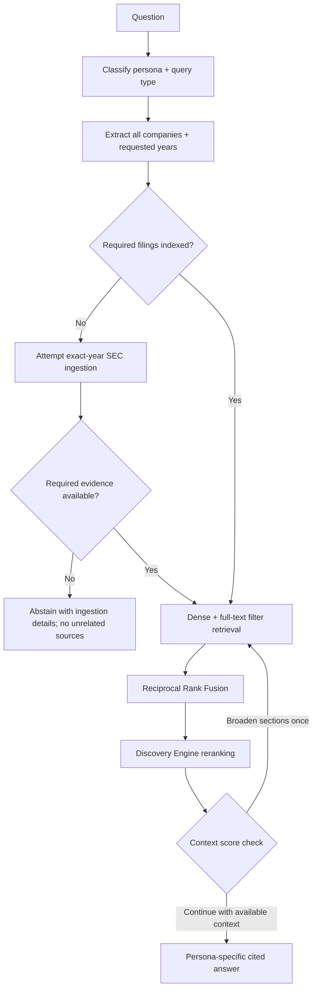

# Financial Report Analyzer

A persona-aware RAG application for analysing SEC financial filings with cited answers in English or Romanian. The initial Apple, Microsoft and Alphabet corpus can grow through HTML uploads and SEC EDGAR ingestion triggered by a question. The agent resolves the requested company and fiscal year before searching, and abstains when the required evidence cannot be obtained.

## Architecture

### Ingestion



`sec-parser` supplies structural parsing; custom rules identify 10-K sections and disambiguate the repeated Item numbers in Parts I/II of 10-Qs. Six canonical categories support retrieval: risk factors, legal proceedings, MD&A, market risk, financial statements and controls/procedures. Some older chunks retain legacy Item categories. Presence of all six sections is a structural check, not proof of document authenticity or completeness.

Contextual sentences use `gemini-3.1-flash-lite`; embeddings use `gemini-embedding-001` through Vertex AI. The two stores are updated per chunk. Dynamic filings remain `processing` until ingestion completes; interrupted dynamic filings are excluded from scoped retrieval and can be retried.

### Agent workflow



- **Classification:** `gemini-3-flash-preview`, Pydantic structured output, five personas and three query types.
- **Scope:** the resolved companies, explicit fiscal years and allowed document IDs are persisted in LangGraph state and applied to both retrieval routes, including retries. Missing evidence or failed company resolution blocks unrelated-corpus fallback. An unscoped general question can still search across the corpus.
- **Dynamic ingestion:** the SEC ticker catalog resolves company names/tickers; it is not a fixed allowlist of the original three companies. A known company can trigger ingestion for a missing fiscal year. Both recent and historical submissions are searched, and XBRL fiscal-year metadata is checked before indexing. The calendar year of `reportDate` alone is insufficient.
- **Bounds:** at most one filing-ingestion attempt per query, including failures. A comparison requiring more missing filings abstains until the required corpus exists. Ingestion is synchronous and can take several minutes.
- **Retrieval:** dense search plus Qdrant full-text filtering, merged with RRF. The keyword branch has no BM25 relevance ranking; its ordering is a known limitation. Comparison candidates are collected per company before global reranking.
- **Verification:** the threshold is 0.55 with at least three qualifying chunks. The current counter allows one extra retrieval pass with broader sections, retaining company/year constraints. Low scores alone do not prove an answer is wrong or right; empty context leads to abstention.
- **Generation:** `gemini-3-flash-preview`, using the supplied context and `[chunk_id]` citations. `status=valid` means an answer was generated, not that financial claims were independently verified.
- **Observability:** `graph.stream(..., stream_mode="values")` preserves completed-node state on a later failure. Postgres stores query results, partial estimated costs and LangSmith trace IDs. The interface shows execution summaries, not private model reasoning.

**Registrant coverage:** the SEC ticker catalog does not cover every filing entity. An unresolved name such as Taco Bell Funding, LLC is reported explicitly; the application does not silently substitute its parent or another company. Supporting registrants without tickers and identifying subsidiary disclosures requires additional resolution logic.

## Tech stack

| Layer | Dependencies / services used |
|---|---|
| API and validation | Python 3.13, FastAPI, Uvicorn, Pydantic, python-multipart |
| Agent and models | LangGraph, langchain-google-genai, google-genai, google-cloud-discoveryengine |
| Parsing and chunking | BeautifulSoup, sec-parser, langchain-text-splitters, tiktoken |
| Storage | PostgreSQL 16, psycopg2-binary, Qdrant, qdrant-client |
| Interface | Next.js 16.3.4, React 19.2.8, TypeScript, Tailwind CSS 4 |
| Observability and utilities | LangSmith, requests, python-dotenv |
| Testing and deployment | pytest, Playwright, Docker Compose; Python and Node 20 container images |

Backend dependencies in `requirements.txt` are currently unpinned. Model IDs above are those configured in code, not a claim of permanent provider availability.

## Evaluation

Results and full evidence are stored under [`eval/results/`](eval/results/); see the [evaluation report](wiki/pages/evaluation-2026-09-13.md) for current metrics and limitations.

- **Golden set:** 15 questions with expected persona and query-type labels, executed through the real graph. The runner now persists answers, retrieved chunks, trace summaries, latency and estimated cost, alongside classifications. Latest completed run: **15/15 persona, 14/15 query type, 15/15 resolvable citation-ID checks**; estimated cost **$0.181626**.
- **Scope regressions:** live NVIDIA FY2023 in English/Romanian, an Apple/NVIDIA comparison, an unresolved Taco Bell Funding registrant and an unavailable year. Checks enforce requested company/year coverage or abstention without sources. These detect the reported substitution failure, not arbitrary numeric hallucinations.
- **Retrieval replay:** the original 17 synthetic AAPL FY2023 questions are frozen and replayed against dense retrieval. Source-chunk Hit@8 and MRR are saved per question. This is a small, single-document probe; the source chunk is not an exhaustive annotation of all relevant passages.
- **Unit and browser tests:** **91 passed, 2 skipped** in pytest ([per-module breakdown](wiki/pages/unit-tests-by-module.md)); **14 browser scenarios passed**, including two real API upload cases (Winmark ready; legacy YUM explicitly unsupported). The other browser cases mock responses; the live upload run incurs ingestion cost.

**Still unmeasured:** end-to-end golden-set Recall@8 (its `expected_chunk_ids` remain null) and a calibrated faithfulness rate. Classification accuracy, source-scope checks and citation-ID checks must not be presented as financial-answer accuracy. No unvalidated LLM judge score is used as a portfolio performance claim.

## Cost analysis

`src/storage/cost.py` estimates classification, entity-resolution, generation and contextualisation costs using returned token usage and a local rate card. [`scripts/cost_trends.py`](scripts/cost_trends.py) aggregates logged queries by persona, query type, outcome and whether ingestion occurred; the [cost report](wiki/pages/cost-trends.md) contains the latest aggregate.

These are **partial estimates, not GCP bills**: the rate card is marked as a placeholder, embedding calls are not accounted for, and the configured reranker price is zero pending verification. An ingestion failure can also omit cost spent before the failing function returned. `retry_count` is not stored in `query_logs`; operational traces carry retry information. Historical mixed-model averages do not establish the causal cost of a query type.

## Setup & Run

Requires Docker, a Google Cloud project with Vertex AI and Discovery Engine access, Gemini credentials and a service-account JSON readable from the host.

```bash
git clone https://github.com/EdenIBD/financial-report-analyzer.git
cd financial-report-analyzer
cp .env.example .env
```

Set `GOOGLE_API_KEY`, `GOOGLE_CLOUD_PROJECT`, `GOOGLE_CLOUD_LOCATION`, `GOOGLE_APPLICATION_CREDENTIALS` (absolute host path to the JSON), and SEC identification variables `EDGAR_USER_AGENT_NAME` / `EDGAR_USER_AGENT_EMAIL`. Configure the optional LangSmith variables shown in `.env.example` for tracing. Never commit credentials.

```bash
docker compose up -d --build
# Required once when upgrading an existing database:
docker compose exec -T postgres psql -U postgres -d financial_report_analyzer \
  < scripts/migrate_ingestion_status.sql
# First installation only: create the vector collection.
docker compose exec api python -m src.storage.qdrant_setup
# Optional initial corpus download + ingestion (makes paid model calls).
docker compose exec api python scripts/download_filings.py
docker compose exec api python -c "from scripts.run_ingestion import main; main()"
```

Open [the frontend](http://localhost:3000); the API is at [localhost:8000](http://localhost:8000/docs), Qdrant at port 6333, and PostgreSQL at host port 5433. The sidebar lists the live corpus. Upload `.html` / `.htm` 10-K or 10-Q filings, or ask for a company and fiscal year. Dynamic ingestion uses annual 10-Ks unless a 10-Q is explicitly requested.

```bash
curl -X POST http://localhost:8000/query -H 'Content-Type: application/json' \
  -d '{"raw_query":"Summarize Nvidia fiscal year 2023 financial performance"}'

python -m venv venv
source venv/bin/activate
pip install -r requirements.txt
python -m pytest tests/
cd frontend
npm ci
npx playwright install chromium
npx playwright test
```

Browser tests use a separate development server on port **3001**, avoiding an old Docker build on 3000. For a frontend-only deployment use `docker compose up -d --build --no-deps frontend`. Recreating the API container interrupts ingestion jobs running inside it; wait for them to finish before rebuilding it.

Paid live evaluations:

```bash
docker compose exec api python -m eval.run_golden_set
docker compose exec api python -m eval.run_scope_regressions
docker compose exec api python -m eval.replay_retrieval
```

Evaluation output is written inside the container under `/app/eval/results`; copy it out with `docker compose cp api:/app/eval/results/. eval/results/`. Golden-set and cost Markdown reports are written under `/app/wiki/pages`.

### Upload compatibility validation

Ten real SEC filings were tested, plus three saved/encoding variants: **10 accepted, 3 explicitly unsupported legacy files**. This includes large and small issuers, 10-K/10-Q, pre-inline-XBRL documents, a native Chrome save and a derived UTF-8 BOM copy. Microsoft nested metadata and Winmark colon-delimited headings are covered by real HTML regression fixtures. All six canonical categories remain mandatory. See the [per-file results](wiki/pages/upload-evaluation-2026-09-13.md).

Uploads require inline XBRL metadata; older plain HTML filings remain unsupported. Download the original primary HTML, rather than an SEC viewer wrapper. Encoding is decoded without silently dropping bytes. Run `python -m eval.run_upload_matrix` with the manifest's local files; `RUN_LIVE_UPLOAD=1 npx playwright test` from `frontend` also exercises real uploads and incurs ingestion cost.

## Project status

The four-service application, contextual ingestion, persona routing, citation UI, uploads and dynamic annual-filing ingestion are implemented. The September 13 Microsoft repair audit verified all 16 targeted sections against fresh parsing, plus identical IDs/text across PostgreSQL and Qdrant for the then-current 9,189 chunks. See [the audit](eval/results/corpus-audit.json); this is a data-consistency check, not a parsing-quality benchmark.

Remaining limitations:

- No manually annotated golden retrieval targets or calibrated faithfulness evaluator.
- Some filings incorporate financial statements by reference; six detected headings do not ensure substantive financial coverage. Complex tables and 10-K section detection need further validation.
- 158 legacy-category chunks remain flagged by the old contextual-sentence heuristic and are excluded by canonical-section retrieval filters. Its one remaining canonical NVIDIA flag is a legitimate Microsoft agreement mention in the source, not a wrong-company sentence.
- No durable background-job queue or automatic recovery of interrupted uploads. The corpus is shared; authentication and tenant isolation are not implemented.
- Registrants without catalog tickers, 20-Fs, PDFs and quarter-specific 10-Q identity are not fully supported. Two 10-Qs for the same ticker/year can share a document ID.
- Explicit fiscal-year constraints are supported; relative phrases such as “last year” and “latest” are not resolved against a refreshed filing calendar. Without an explicit year, retrieval may span indexed fiscal years. Company-specific year pairings in complex comparisons need a richer query schema.
- Costs are partial estimates and retrieval ranking remains subject to the keyword-branch limitation above.

[Presentation](presentation.html) · [Obsidian wiki index](wiki/index.md) · [Failure analyses](wiki/pages/failure-patterns/)
