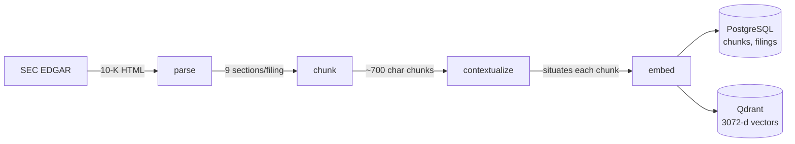
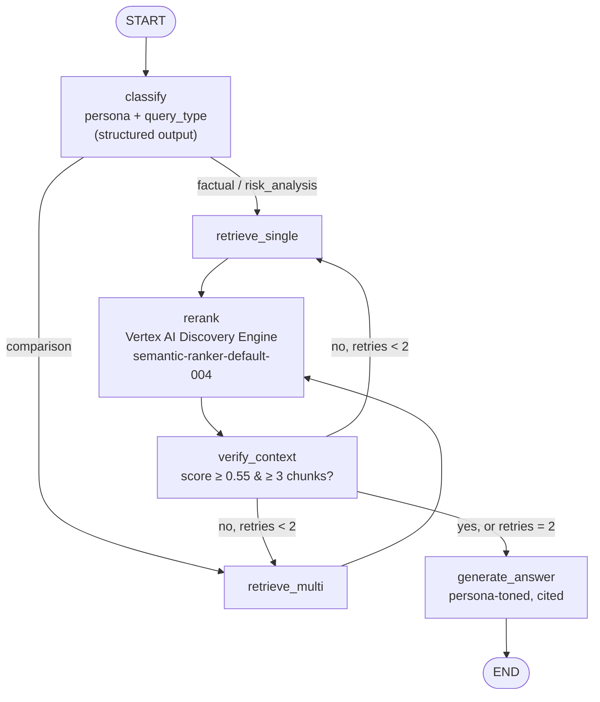
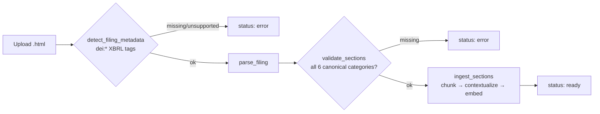

# Financial Report Analyzer

A persona-aware RAG agent that answers questions about SEC 10-K filings from Apple, Microsoft, and Google (FY2020–FY2026, 14 filings, 8,250 indexed chunks). The system classifies each query by *who is asking* (legal, audit, investment firm, investment bank, treasury) and *what kind of answer they need* (factual, comparison, risk analysis), routes retrieval accordingly, and returns a cited answer alongside its cost and trace ID.

Built as an end-to-end exercise in shipping a RAG pipeline that actually runs: containerized, tested, traced, and debugged against real API behavior rather than documentation.

---

## Architecture

The system has two pipelines: an offline **ingestion** pipeline (run once per filing) and an online **agent** pipeline (run per query), served over a small FastAPI backend and a Next.js frontend.

### Ingestion



- **parse** (`src/ingestion/parse.py`) — `sec-parser`'s `Edgar10QParser` has no 10-K-specific classifier, so section boundaries are extracted by regex on title text rather than the library's own (10-Q-shaped) semantic labels. Extracted sections are mapped to a **canonical taxonomy** (`src/ingestion/sections.py`) shared between 10-K and 10-Q — the same semantic content lives at different Item numbers in each (MD&A is Item 7 in a 10-K, Item 2 in a 10-Q), and a 10-Q additionally reuses Item 1–4 with a different meaning in Part I vs. Part II (Part I Item 1 = Financial Statements, Part II Item 1 = Legal Proceedings), which the parser disambiguates by tracking the current Part while walking the section tree. Retrieval (`PERSONA_SECTIONS` below) filters on these canonical categories, not raw Item numbers, so it works identically regardless of filing type.
- **chunk** (`src/ingestion/chunk.py`) — `RecursiveCharacterTextSplitter`, 700 chars, 100 overlap, applied per section.
- **contextualize** (`src/ingestion/contextual.py`) — an LLM call (`gemini-3.1-flash-lite`) prepends 1–2 sentences situating each chunk (company, fiscal year, section) before embedding — the "contextual retrieval" pattern.
- **embed** (`src/retrieval/embed.py`) — `gemini-embedding-001` via Vertex AI, 3072-dim vectors, written to both stores.

### Agent (LangGraph)



- **classify** — structured output (Pydantic) classifying into 5 personas × 3 query types, with a system prompt carrying few-shot examples per category.
- **retrieve_single / retrieve_multi** — hybrid retrieval: a dense vector search (Qdrant) plus a keyword/full-text filter search, combined with Reciprocal Rank Fusion (`src/retrieval/fusion.py`). Retrieval is pre-filtered by persona to the 10-K sections that persona actually cares about (e.g. `legal` → Item 3 + 1A, `treasury` → Item 7A + 8). `retrieve_multi` handles comparison queries across the 3 known tickers, falling back to searching all of them if none is named explicitly in the query.
- **rerank** — Vertex AI Discovery Engine semantic reranker, re-scoring the fused candidates.
- **verify_context** — checks reranked scores against a threshold; on insufficient context, widens the section filter to a fixed fallback set and retries retrieval up to twice before forcing generation.
- **generate_answer** — a single base prompt with mandatory inline `[chunk_id]` citations, plus a persona-specific tone instruction appended (one prompt, not five).

The API (`src/api/main.py`) streams the graph node-by-node (`graph.stream(..., stream_mode="values")`) rather than a single `.invoke()`, so that if a later node fails, the classification and partial cost already accumulated are not discarded — every request is logged to Postgres regardless of outcome, and traced end-to-end in LangSmith via `@traceable`.

### Document upload

Beyond the fixed 14-filing corpus, a user can upload a 10-K/10-Q directly from the frontend (`POST /documents/upload`, `src/api/documents.py`) instead of running ingestion scripts by hand:



- **Format validated before anything is indexed, in two steps** — first that the file is a real SEC EDGAR filing at all (`src/ingestion/detect.py` reads the standard inline-XBRL `dei:DocumentType` / `dei:TradingSymbol` / `dei:DocumentFiscalYearFocus` tags every modern EDGAR filing carries — far more reliable than scraping free-text cover pages), then that parsing actually found all 6 canonical sections (`validate_sections`). Either failure sets `status: error` with a reason; nothing partial gets written to Postgres/Qdrant.
- **Metadata is auto-detected**, not asked of the user — company, ticker, fiscal year, and filing type all come from the same `dei:*` tags.
- **Processed asynchronously**: the upload call returns a `document_id` immediately; processing (parse → chunk → contextual retrieval → embed → index, realistically 1–3 minutes) runs in a FastAPI `BackgroundTasks` job, and the frontend polls `GET /documents/{document_id}/status` until it flips to `ready` or `error`.
- **Indexed into the same global corpus** the fixed filings live in — reusing the exact same `ingest_sections` pipeline function (`src/ingestion/pipeline.py`) that `scripts/run_ingestion.py` calls for the EDGAR-downloaded corpus, so there is one processing implementation, not two. `doc_id` is suffixed with the filing type (`AAPL_2026_10Q`) so an uploaded 10-Q can't collide with an existing 10-K for the same ticker/year.
- **Verified live end-to-end**: a real Apple 10-Q (FY2026 Q3, not part of the fixed corpus) was uploaded through this endpoint, indexed into 159 chunks across all 6 canonical sections, and successfully retrieved and cited (`AAPL_2026_10Q_risk_factors_21`) by a live `/query` naming its Digital Markets Act disclosure — then removed again to keep the documented corpus numbers below accurate to the fixed 14-filing baseline.
- **Known limitation, not specific to upload**: `retrieve_single` (used for factual/risk-analysis queries) filters by section but not by company or fiscal year, so a vague query can surface older chunks over a just-uploaded document; `retrieve_multi` (comparison queries) already filters by company. Tightening `retrieve_single` the same way is a natural next step, not yet built.

---

## Tech stack

| Layer | Technology |
|---|---|
| Agent orchestration | LangGraph, LangChain (`langchain-google-genai`) |
| LLM | Google Gemini — `gemini-3-flash-preview` (classify + generate), `gemini-3.1-flash-lite` (contextual retrieval) |
| Embeddings | `gemini-embedding-001` via Vertex AI (`google-genai`, 3072-d) |
| Reranking | Vertex AI Discovery Engine (`google-cloud-discoveryengine`), `semantic-ranker-default-004` |
| Vector store | Qdrant |
| Relational store | PostgreSQL 16 |
| API | FastAPI, uvicorn, Pydantic |
| Frontend | Next.js 16, React 19, Tailwind CSS |
| Document parsing | `sec-parser`, `tiktoken` (chunk sizing), `langchain-text-splitters` |
| Observability | LangSmith tracing |
| Testing | pytest (50 unit tests), Playwright (3 E2E scenarios) |
| Infra | Docker / docker-compose (4 services: `postgres`, `qdrant`, `api`, `frontend`) |

Full pinned list in [`requirements.txt`](requirements.txt) (backend) and [`frontend/package.json`](frontend/package.json).

---

## Evaluation

**Status: partial.** The golden set has been run end-to-end through the live pipeline for classification accuracy; retrieval recall and faithfulness have not, because the ground truth they need doesn't exist yet (see below). No number in this section is invented; where something hasn't been measured, it's marked as such.

### Golden set — run end-to-end

[`eval/golden_set.json`](eval/golden_set.json): 15 hand-written questions, balanced across all 5 personas (3 each) and all 3 query types (5 each). [`eval/run_golden_set.py`](eval/run_golden_set.py) sends each through `handle_query()` — the full graph: classify → retrieve → rerank → verify → generate — and compares the agent's classification against the expected labels.

**Last run** (reproducible via `python -m eval.run_golden_set`; full per-question detail in [`wiki/pages/golden-set-results.md`](wiki/pages/golden-set-results.md), rows also written to the `eval_set` table):

| Metric | Threshold | Result |
|---|---|---|
| Persona classification accuracy | 0.85 | **15/15 = 100.00%** |
| Query-type classification accuracy | 0.80 | **14/15 = 93.33%** |
| Answers generated (`status: valid`) | — | 15/15 |
| Total cost, 15 queries | — | $0.192624 |

The one query-type miss: a risk-analysis question about internal-control weaknesses was classified as `factual`. Both classification metrics clear their thresholds.

**Not measured — no ground truth exists yet, not because it was skipped:**

| Metric | Threshold | Why it's unmeasured |
|---|---|---|
| Retrieval Recall@8 | 0.70 | Needs `expected_chunk_ids` per question — nobody has manually annotated which chunks answer each of the 15 questions. `golden_set.json` carries `expected_chunk_ids: null`. |
| Faithfulness | 0.90 | Needs an LLM-judge step that checks each answer against its retrieved context; not implemented. |

### Retrieval probe — run, real, narrow scope

A separate, smaller retrieval-only check exists ([`eval/retrieval_eval.py`](eval/retrieval_eval.py)): synthetic questions are generated (via LLM, one fact per chunk) from a sample of chunks — 2 per section — from a single filing (`AAPL_2023`, 17 questions), then dense-vector Recall@8 is measured against Qdrant directly (no reranking, no persona filtering — this measures the embedding step in isolation, not the full agent pipeline).

**Last run** (reproducible via `python -m eval.retrieval_eval`):

```
Recall@8: 13/17 = 76.47%
```

4 misses, of which 2 are degenerate synthetic questions the generator produced without a realism filter (e.g. *"What is the title of the provided text?"* — the pipeline has no realism-scoring step yet, a known, documented gap). Discounting those, real retrieval failures on this sample are 2/17. Sample size is too small (one filing, 17 questions) to generalize — this is a smoke test of the embedding pipeline, not a validated recall number for the system.

### What full evaluation still requires

Classification accuracy is measured (above). What's left: manually annotating `expected_chunk_ids` for the 15 golden questions to get a real Recall@8, and implementing an LLM-judge step for faithfulness — both call for human judgment about what counts as a correct source or a grounded claim, not something to script around.

---

## Cost analysis

Real, not planned: every graph node that makes an LLM/rerank call adds its cost to `state["cost_usd"]` (`src/storage/cost.py`, computed from actual API `usage_metadata`, not the tokenizer estimate), and every query is logged to `query_logs.cost_usd` regardless of success or failure.

[`scripts/cost_trends.py`](scripts/cost_trends.py) aggregates this directly from Postgres. Last run, over 27 logged queries:

| query_type | n | avg cost (USD) |
|---|---|---|
| comparison | 10 | 0.003444 |
| factual | 8 | 0.001492 |
| risk_analysis | 4 | 0.000504 |

Comparison queries cost **~2.3×** factual queries on average — consistent with `retrieve_multi` running hybrid search + fusion across up to 3 companies instead of 1.

| persona | n | avg cost (USD) |
|---|---|---|
| investment_firm | 13 | 0.002795 |
| treasury | 6 | 0.001849 |
| legal | 2 | 0.000395 |
| investment_bank | 1 | 0.000179 |

**Known gaps**, documented rather than papered over:
- Embedding cost is not included in `cost_usd` — `embed_content` doesn't return usage in a form the code captures without a duplicate API call, so it's a real, acknowledged undercount.
- `retry_count` is not persisted to `query_logs` (schema has no column for it, and adding one was explicitly out of scope), so "cost per retry" cannot be computed from logged data alone, only from LangSmith traces directly.
- Pricing table is a placeholder rate card, not pulled from live GCP billing — see the `# TODO` in `cost.py`.

---

## Setup & Run

Requires Docker, and a GCP project with **Vertex AI** and **Discovery Engine API** enabled, plus a service account JSON with access to both.

```bash
git clone <repo-url> && cd financial-report-analyzer
cp .env.example .env
```

Fill in `.env`: `GOOGLE_API_KEY` (Gemini API key), `GOOGLE_CLOUD_PROJECT` / `GOOGLE_CLOUD_LOCATION` / `GOOGLE_APPLICATION_CREDENTIALS` (Vertex AI + Discovery Engine, same project/service-account for both), `EDGAR_USER_AGENT_NAME` / `EDGAR_USER_AGENT_EMAIL` (required by SEC EDGAR's fair-use policy), and optionally `LANGCHAIN_API_KEY` for tracing.

```bash
# 1. Bring up all 4 services (Postgres schema is applied automatically on first boot)
docker compose up -d --build

# 2. Create the Qdrant collection (run once)
docker compose exec api python src/storage/qdrant_setup.py

# 3. Download the 14 filings from SEC EDGAR (~0.2s rate-limited requests)
docker compose exec api python scripts/download_filings.py

# 4. Run ingestion — parses, chunks, contextualizes, embeds, and writes to both stores
#    (~8,250 chunks, ~16.5k LLM/embedding calls; retries transient 5xx automatically)
docker compose exec api python -c "from scripts.run_ingestion import main; main()"
```

Then open **http://localhost:3000**. Backend directly: `POST http://localhost:8000/query` with `{"raw_query": "..."}`; `GET /health` for a liveness check.

```bash
# Unit tests (no live services required beyond dummy env vars — see tests/conftest.py)
python -m pytest tests/

# E2E (frontend, mocked API responses)
cd frontend && npx playwright test
```

---

## Project status

**Working end-to-end:** ingestion (14/14 filings, 8,250/8,250 chunks verified in both Postgres and Qdrant), classification (100% persona / 93.33% query-type accuracy on the golden set), hybrid retrieval with RRF, Vertex AI reranking, persona-toned cited generation, cost tracking, LangSmith tracing, all 4 services containerized, 50 passing unit tests, 3 passing E2E scenarios, and a document-upload feature (10-K/10-Q, async, auto-detected metadata, format-validated before indexing) verified live against a real filing.

**Not done:**
- Retrieval recall and faithfulness against the golden set — blocked on manual chunk-relevance annotation and an LLM-judge implementation, not on running the pipeline (classification accuracy already is).
- Embedding cost tracking (see Cost analysis).
- Retrieval eval is single-filing / 17-question scope, not corpus-wide.
- `retrieve_single` has no company/fiscal-year filter (see Document upload) — a real gap uploads made visible, not one they introduced.
- No auth (intentional — single-user demo scope); uploads land in one shared global corpus, not scoped per user or session.

**Debugged against real behavior, not assumptions** — 9 issues found by running the system against live APIs and traced in [`wiki/pages/failure-patterns/`](wiki/pages/failure-patterns/), including two that only surfaced once the reranker started working: a router function whose state mutations LangGraph silently discarded (causing an actual infinite retry loop, stopped only by Google's own rate limiter, before the fix), and a comparison-query path that returned zero results whenever no company was named explicitly. Both are fixed and covered by regression tests.
