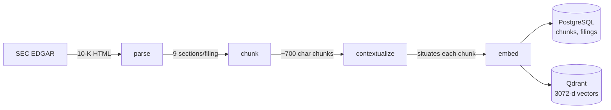
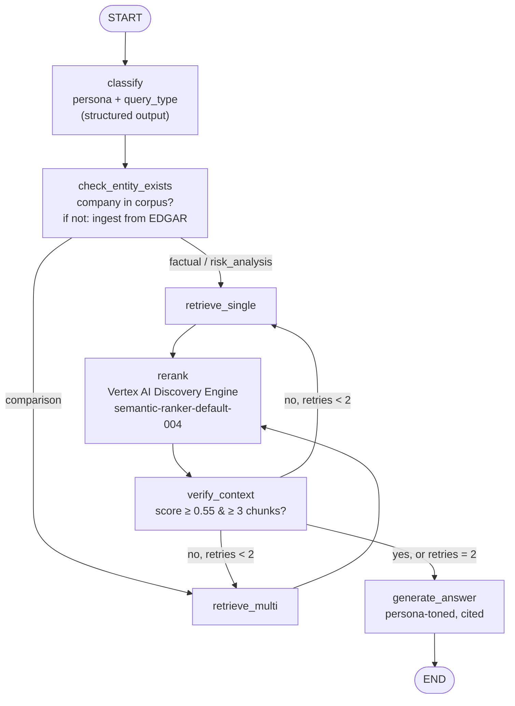
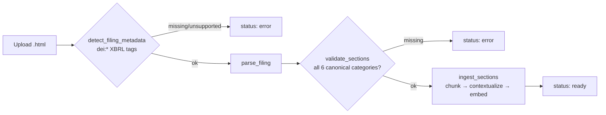

# Financial Report Analyzer

A persona-aware RAG agent that answers questions about SEC 10-K filings. It ships with a fixed corpus of Apple, Microsoft and Google filings (FY2020–FY2026, 14 filings, 8,250 chunks) and extends itself beyond it at runtime — uploaded filings and companies fetched live from SEC EDGAR when a question names one that isn't indexed yet (currently 15 filings, 8,597 chunks). The system classifies each query by *who is asking* (legal, audit, investment firm, investment bank, treasury) and *what kind of answer they need* (factual, comparison, risk analysis), routes retrieval accordingly, and returns a cited answer alongside its cost and trace ID.

Built as an end-to-end exercise in shipping a RAG pipeline that actually runs: containerized, tested, traced, and debugged against real API behavior rather than documentation.

---

## Architecture

The system has two pipelines: an offline **ingestion** pipeline (run once per filing) and an online **agent** pipeline (run per query), served over a small FastAPI backend and a Next.js frontend.

### Ingestion



- **parse** (`src/ingestion/parse.py`) — `sec-parser`'s `Edgar10QParser` has no 10-K-specific classifier, so section boundaries are extracted by regex on title text rather than the library's own (10-Q-shaped) semantic labels. Extracted sections are mapped to a **canonical taxonomy** (`src/ingestion/sections.py`) shared between 10-K and 10-Q — the same semantic content lives at different Item numbers in each (MD&A is Item 7 in a 10-K, Item 2 in a 10-Q), and a 10-Q additionally reuses Item 1–4 with a different meaning in Part I vs. Part II (Part I Item 1 = Financial Statements, Part II Item 1 = Legal Proceedings), which the parser disambiguates by tracking the current Part while walking the section tree. Retrieval (`PERSONA_SECTIONS` below) filters on these canonical categories, not raw Item numbers, so it works identically regardless of filing type.
- **chunk** (`src/ingestion/chunk.py`) — `RecursiveCharacterTextSplitter`, 700 chars, 100 overlap, applied per section.
- **contextualize** (`src/ingestion/contextual.py`) — an LLM call (`gemini-3.1-flash-lite`) prepends a sentence situating each chunk (company, fiscal year, section) before embedding — the "contextual retrieval" pattern. **Known defect on ~28% of the existing corpus**, found by reading actual retrieved-chunk text in the UI rather than trusting the pipeline: the prompt never actually passed the filing's identity to the model, so it guessed — and guessed "Apple" often enough that 45% of GOOGL chunks and 33% of MSFT chunks carry a situating sentence naming the wrong company. Retrieval itself is unaffected (filtering uses the real `company` field, not this sentence), but the embedded text does — see [`wiki/pages/failure-patterns/contextual-retrieval-wrong-company.md`](wiki/pages/failure-patterns/contextual-retrieval-wrong-company.md) for the exact counts. The prompt is fixed for all ingestion going forward (verified live across 4 companies); the ~2,586 already-affected chunks are not yet re-processed.
- **embed** (`src/retrieval/embed.py`) — `gemini-embedding-001` via Vertex AI, 3072-dim vectors, written to both stores.

### Agent (LangGraph)



- **classify** — structured output (Pydantic) classifying into 5 personas × 3 query types, with a system prompt carrying few-shot examples per category.
- **check_entity_exists** — resolves the companies named in the question against the corpus; anything missing is fetched from SEC EDGAR and ingested before retrieval runs (see Dynamic ingestion below).
- **retrieve_single / retrieve_multi** — hybrid retrieval: a dense vector search (Qdrant) plus a keyword/full-text filter search, combined with Reciprocal Rank Fusion (`src/retrieval/fusion.py`). Retrieval is pre-filtered by persona to the **canonical section categories** that persona actually cares about (e.g. `legal` → `legal_proceedings` + `risk_factors`, `treasury` → `market_risk` + `financial_statements`) — categories, not raw Item numbers, because 10-K and 10-Q number the same content differently. `retrieve_multi` handles comparison queries across the companies named, falling back to every ticker currently in the corpus if none is named explicitly.
- **rerank** — Vertex AI Discovery Engine semantic reranker, re-scoring the fused candidates.
- **verify_context** — checks reranked scores against a threshold; on insufficient context, widens the section filter to a fixed fallback set and retries retrieval up to twice before forcing generation.
- **generate_answer** — a single base prompt with mandatory inline `[chunk_id]` citations, plus a persona-specific tone instruction appended (one prompt, not five).

The API (`src/api/main.py`) streams the graph node-by-node (`graph.stream(..., stream_mode="values")`) rather than a single `.invoke()`, so that if a later node fails, the classification and partial cost already accumulated are not discarded — every request is logged to Postgres regardless of outcome, and traced end-to-end in LangSmith via `@traceable`.

### Document upload

Beyond the fixed 14-filing corpus, a user can upload a 10-K/10-Q directly from the frontend (`POST /documents/upload`, `src/api/documents.py`) instead of running ingestion scripts by hand:



- **Format validated before anything is indexed, in two steps** — first that the file is a real SEC EDGAR filing at all (`src/ingestion/detect.py` reads the standard inline-XBRL `dei:DocumentType` / `dei:TradingSymbol` / `dei:DocumentFiscalYearFocus` tags every modern EDGAR filing carries — far more reliable than scraping free-text cover pages), then that parsing actually found all 6 canonical sections (`validate_sections`). Either failure sets `status: error` with a reason; nothing partial gets written to Postgres/Qdrant.
- **Metadata is auto-detected**, not asked of the user — company, ticker, fiscal year, and filing type all come from the same `dei:*` tags.
- **Processed asynchronously**: the upload call returns a `document_id` immediately; processing (parse → chunk → contextual retrieval → embed → index, realistically 1–3 minutes) runs in a FastAPI `BackgroundTasks` job, and the frontend polls `GET /documents/{document_id}/status` until it flips to `ready` or `error`.
- **Indexed into the same global corpus** the fixed filings live in — reusing the exact same `ingest_sections` pipeline function (`src/ingestion/pipeline.py`) that `scripts/run_ingestion.py` calls for the EDGAR-downloaded corpus, so there is one processing implementation, not two. `doc_id` is suffixed with the filing type (`AAPL_2026_10Q`) so an uploaded 10-Q can't collide with an existing 10-K for the same ticker/year.
- **Verified live end-to-end**: a real Apple 10-Q (FY2026 Q3, not part of the fixed corpus) was uploaded through this endpoint, indexed into 159 chunks across all 6 canonical sections, and successfully retrieved and cited (`AAPL_2026_10Q_risk_factors_21`) by a live `/query` naming its Digital Markets Act disclosure — then removed again to keep the documented corpus numbers below accurate to the fixed 14-filing baseline.
- **Known limitation, not specific to upload**: `retrieve_single` (used for factual/risk-analysis queries) filters by section but not by company or fiscal year, so a vague query can surface older chunks over a just-uploaded document; `retrieve_multi` (comparison queries) already filters by company. Tightening `retrieve_single` the same way is a natural next step, not yet built.

### Dynamic ingestion

The corpus is not fixed at query time either. If a question names a company that isn't indexed, `check_entity_exists` (`src/agent/nodes/check_entity.py`) fetches its most recent 10-K from SEC EDGAR and ingests it mid-request, before retrieval runs — so the agent can answer about companies it has never seen.

Entity extraction runs in two tiers, the second only when the first finds nothing:

1. **Corpus match** — `SELECT DISTINCT ticker, company FROM filings`, matched on word boundaries (not substrings: with an open corpus a one-letter ticker like `F` would otherwise match almost any question). A small alias map covers brand-vs-registrant mismatches, since "Alphabet Inc." doesn't contain the word "Google".
2. **LLM + EDGAR resolution** — a structured-output call extracts company names as free text, then `resolve_company()` checks them against SEC's public [`company_tickers.json`](https://www.sec.gov/files/company_tickers.json) mapping (cached locally after first download). Exact ticker and exact title match first; prefix matching is a last resort, requires ≥3 characters, and prefers the shortest matching title — an LLM returning `"A"` or `"Apple"` must not resolve to a random company and trigger minutes of pointless ingestion.

Design decisions worth naming:

- **One ingestion per query** (`MAX_INGESTIONS_PER_QUERY = 1`). Ingesting a filing is minutes of work, so a comparison naming three unknown companies would hang the request for ~30 minutes. The rest come back as explicit entries in `ingestion_errors`, surfaced in the UI — not a silent wait.
- **Nothing propagates as an exception.** A ticker that doesn't exist on EDGAR, a 429 from SEC, a filing whose parsing fails validation — all land in `ingestion_errors` and the query continues answering from the corpus it already has.
- **Ingestion cost is counted.** Contextual retrieval is one LLM call per chunk, so a query that triggers ingestion costs orders of magnitude more than a normal one. `ingest_sections` returns real cost from `usage_metadata` (not an estimate), `check_entity_exists` adds it to `cost_usd`, and `query_logs.ingested_entities` records which queries did it so [`wiki/pages/cost-trends.md`](wiki/pages/cost-trends.md) can separate the two populations instead of averaging them together into a meaningless number.
- **One processing implementation, three entry points.** `scripts/download_filings.py` (CLI), `src/api/documents.py` (upload), and this node all call the same functions in `src/ingestion/pipeline.py`; the scripts are thin wrappers, not copies.
- **Not built, deliberately**: no job queue, no lock against two users ingesting the same company concurrently (worst case: duplicate chunks in Qdrant — acceptable at demo scale), no 10-Q through this path (that's what upload is for), and no detection of new filings for companies already in the corpus.

**Verified live, end-to-end**, with one query about a company that was not in the corpus (*"What does Nvidia report about supply chain and manufacturing risk?"*):

| | measured |
|---|---|
| Company resolved | `Nvidia` → `NVDA` (CIK 0001045810) via tier-2 LLM + EDGAR |
| Filing ingested | NVDA 10-K FY2026, 347 chunks across all 6 canonical categories |
| End-to-end latency | **8 min 14 s** (493,706 ms) vs ~15 s for a normal query |
| Cost | **$0.0673** vs $0.0063 average for the 50 logged non-ingesting queries (~11×) |
| Answer | generated and cited real just-indexed chunks (`NVDA_2026_10K_risk_factors_47`) |

Two honest caveats on those numbers. The cost multiple is a **single observation** (n=1), not a validated average — it's the right order of magnitude, not a benchmark. And the 8-minute latency is well past the 1–3 minutes the feature was scoped against, because contextual retrieval and embedding run sequentially per chunk; `MAX_INGESTIONS_PER_QUERY = 1` is therefore doing more work than expected and is marked in code as needing recalibration against this measurement.

A third finding came out of the same run and is documented in [`wiki/pages/failure-patterns/item8-incorporated-by-reference.md`](wiki/pages/failure-patterns/item8-incorporated-by-reference.md): NVIDIA incorporates Item 8 and Item 3 *by reference*, so those sections parse and pass validation but contain a single ~150-character pointer instead of content (1 chunk each, against 243 for risk factors). `validate_sections` checks presence, not size — for 4 of the 5 personas this is a quiet retrieval failure rather than an error. The threshold that would catch it can't be calibrated from one filing, so it's recorded rather than guessed at.

**Two more bugs found manually testing this feature (2026-09-13), both fixed:**

- **Silent resolution failure on common name variants.** `resolve_company()` compared names verbatim: `"Tesla Inc"` (what an LLM naturally extracts from a question) doesn't equal `"Tesla, Inc."` (SEC's registrant title) and isn't a prefix of it either — the comma breaks `startswith`. The company was dropped with no error, no banner, nothing — the query would just answer as if Tesla didn't exist. `"Amazon.com Inc"` had the same problem for a different reason: naively stripping punctuation turned it into `"amazoncom"`, which no longer matched `"AMAZON COM INC"`. Fixed with `_normalize_company()` — lowercase, punctuation replaced with spaces (not deleted), trailing corporate suffix stripped — applied to both sides of every comparison. Verified live: `resolve_company("Tesla Inc")` and `resolve_company("Amazon.com Inc")` now both resolve correctly; regression tests in `tests/test_dynamic_ingestion.py` cover both.
- **An unrelated LLM hiccup could kill the whole query.** Tier-2 resolution runs on *any* question that doesn't name a company already in the corpus — not just ones that actually mention a new company. That LLM call wasn't wrapped in a `try/except`; a transient failure (rate limit, network blip) propagated out of `check_entity_exists`, crashed the graph node, and turned an otherwise-answerable question into a total `status: "error"` response. Now it degrades to a trace note ("Could not check for an unlisted company: ...") and the query proceeds normally.

**Document-preview card**: when a query does trigger dynamic ingestion, the sidebar now shows what was actually fetched — company, filing type, and fiscal year (`ingestion_details` on the API response, populated from the real values `detect_filing_metadata` read off the filing, not guessed).

### Frontend & reasoning trace

The UI (`frontend/app/page.tsx`) is a two-pane layout, built against a design mockup: a navy sidebar showing the live corpus (fetched from `GET /corpus`, not hardcoded — it grows via upload and dynamic ingestion, so a static "3 companies" label would go stale within one query) plus a drag-and-drop upload zone, and a light query pane with example-question chips and a chat-style input. When a query triggers dynamic ingestion, the sidebar renders a document-preview card with the real company, filing type, and fiscal year that was fetched — not a placeholder.

Every graph node appends a plain-English line to `state["trace"]` describing what it actually did — not a fabricated token-level chain-of-thought, but a real account of the pipeline's own decisions: how the question was classified (with the model's own one-sentence reasoning, requested explicitly in the `classify` prompt), whether an unindexed company triggered dynamic ingestion, which canonical sections were searched, the reranker's top score, whether `verify_context` had to retry with fallback sections, and how many sources the final answer cited. The API returns this as `reasoning_trace`; the frontend shows it collapsed under "How this answer was put together" so the mechanism is inspectable without cluttering the default view. Verified live — a real query about Apple's liquidity retried twice with broader sections before generating (top rerank score 0.42, then 0.66, still under the 3-good-chunks threshold) before answering, and every trace line matched what the logs showed actually happened.

---

## Tech stack

| Layer | Technology |
|---|---|
| Agent orchestration | LangGraph, LangChain (`langchain-google-genai`) |
| LLM | Google Gemini — `gemini-3-flash-preview` (classify + generate), `gemini-3.1-flash-lite` (contextual retrieval) |
| Embeddings | `gemini-embedding-001` via Vertex AI (`google-genai`, 3072-d) |
| Reranking | Vertex AI Discovery Engine (`google-cloud-discoveryengine`), `semantic-ranker-default-004` |
| Vector store | Qdrant |
| Relational store | PostgreSQL 16 |
| API | FastAPI, uvicorn, Pydantic |
| Frontend | Next.js 16, React 19, Tailwind CSS |
| Document parsing | `sec-parser`, `tiktoken` (chunk sizing), `langchain-text-splitters` |
| Observability | LangSmith tracing |
| Testing | pytest (50 unit tests), Playwright (3 E2E scenarios) |
| Infra | Docker / docker-compose (4 services: `postgres`, `qdrant`, `api`, `frontend`) |

Full pinned list in [`requirements.txt`](requirements.txt) (backend) and [`frontend/package.json`](frontend/package.json).

---

## Evaluation

**Status: partial.** The golden set has been run end-to-end through the live pipeline for classification accuracy; retrieval recall and faithfulness have not, because the ground truth they need doesn't exist yet (see below). No number in this section is invented; where something hasn't been measured, it's marked as such.

### Golden set — run end-to-end

[`eval/golden_set.json`](eval/golden_set.json): 15 hand-written questions, balanced across all 5 personas (3 each) and all 3 query types (5 each). [`eval/run_golden_set.py`](eval/run_golden_set.py) sends each through `handle_query()` — the full graph: classify → retrieve → rerank → verify → generate — and compares the agent's classification against the expected labels.

**Last run** (reproducible via `python -m eval.run_golden_set`; full per-question detail in [`wiki/pages/golden-set-results.md`](wiki/pages/golden-set-results.md), rows also written to the `eval_set` table):

| Metric | Threshold | Result |
|---|---|---|
| Persona classification accuracy | 0.85 | **15/15 = 100.00%** |
| Query-type classification accuracy | 0.80 | **14/15 = 93.33%** |
| Answers generated (`status: valid`) | — | 15/15 |
| Total cost, 15 queries | — | $0.192624 |

The one query-type miss: a risk-analysis question about internal-control weaknesses was classified as `factual`. Both classification metrics clear their thresholds.

**Not measured — no ground truth exists yet, not because it was skipped:**

| Metric | Threshold | Why it's unmeasured |
|---|---|---|
| Retrieval Recall@8 | 0.70 | Needs `expected_chunk_ids` per question — nobody has manually annotated which chunks answer each of the 15 questions. `golden_set.json` carries `expected_chunk_ids: null`. |
| Faithfulness | 0.90 | Needs an LLM-judge step that checks each answer against its retrieved context; not implemented. |

### Retrieval probe — run, real, narrow scope

A separate, smaller retrieval-only check exists ([`eval/retrieval_eval.py`](eval/retrieval_eval.py)): synthetic questions are generated (via LLM, one fact per chunk) from a sample of chunks — 2 per section — from a single filing (`AAPL_2023`, 17 questions), then dense-vector Recall@8 is measured against Qdrant directly (no reranking, no persona filtering — this measures the embedding step in isolation, not the full agent pipeline).

**Last run** (reproducible via `python -m eval.retrieval_eval`):

```
Recall@8: 13/17 = 76.47%
```

4 misses, of which 2 are degenerate synthetic questions the generator produced without a realism filter (e.g. *"What is the title of the provided text?"* — the pipeline has no realism-scoring step yet, a known, documented gap). Discounting those, real retrieval failures on this sample are 2/17. Sample size is too small (one filing, 17 questions) to generalize — this is a smoke test of the embedding pipeline, not a validated recall number for the system.

### What full evaluation still requires

Classification accuracy is measured (above). What's left: manually annotating `expected_chunk_ids` for the 15 golden questions to get a real Recall@8, and implementing an LLM-judge step for faithfulness — both call for human judgment about what counts as a correct source or a grounded claim, not something to script around.

---

## Cost analysis

Real, not planned: every graph node that makes an LLM/rerank call adds its cost to `state["cost_usd"]` (`src/storage/cost.py`, computed from actual API `usage_metadata`, not the tokenizer estimate), and every query is logged to `query_logs.cost_usd` regardless of success or failure.

[`scripts/cost_trends.py`](scripts/cost_trends.py) aggregates this directly from Postgres. Last run, over 27 logged queries:

| query_type | n | avg cost (USD) |
|---|---|---|
| comparison | 10 | 0.003444 |
| factual | 8 | 0.001492 |
| risk_analysis | 4 | 0.000504 |

Comparison queries cost **~2.3×** factual queries on average — consistent with `retrieve_multi` running hybrid search + fusion across up to 3 companies instead of 1.

| persona | n | avg cost (USD) |
|---|---|---|
| investment_firm | 13 | 0.002795 |
| treasury | 6 | 0.001849 |
| legal | 2 | 0.000395 |
| investment_bank | 1 | 0.000179 |

**Known gaps**, documented rather than papered over:
- Embedding cost is not included in `cost_usd` — `embed_content` doesn't return usage in a form the code captures without a duplicate API call, so it's a real, acknowledged undercount.
- `retry_count` is not persisted to `query_logs` (schema has no column for it, and adding one was explicitly out of scope), so "cost per retry" cannot be computed from logged data alone, only from LangSmith traces directly.
- Pricing table is a placeholder rate card, not pulled from live GCP billing — see the `# TODO` in `cost.py`.

---

## Setup & Run

Requires Docker, and a GCP project with **Vertex AI** and **Discovery Engine API** enabled, plus a service account JSON with access to both.

```bash
git clone <repo-url> && cd financial-report-analyzer
cp .env.example .env
```

Fill in `.env`: `GOOGLE_API_KEY` (Gemini API key), `GOOGLE_CLOUD_PROJECT` / `GOOGLE_CLOUD_LOCATION` / `GOOGLE_APPLICATION_CREDENTIALS` (Vertex AI + Discovery Engine, same project/service-account for both), `EDGAR_USER_AGENT_NAME` / `EDGAR_USER_AGENT_EMAIL` (required by SEC EDGAR's fair-use policy), and optionally `LANGCHAIN_API_KEY` for tracing.

```bash
# 1. Bring up all 4 services (Postgres schema is applied automatically on first boot)
docker compose up -d --build

# 2. Create the Qdrant collection (run once)
docker compose exec api python src/storage/qdrant_setup.py

# 3. Download the 14 filings from SEC EDGAR (~0.2s rate-limited requests)
docker compose exec api python scripts/download_filings.py

# 4. Run ingestion — parses, chunks, contextualizes, embeds, and writes to both stores
#    (~8,250 chunks, ~16.5k LLM/embedding calls; retries transient 5xx automatically)
docker compose exec api python -c "from scripts.run_ingestion import main; main()"
```

Then open **http://localhost:3000**. Backend directly: `POST http://localhost:8000/query` with `{"raw_query": "..."}`; `GET /health` for a liveness check.

```bash
# Unit tests (no live services required beyond dummy env vars — see tests/conftest.py)
python -m pytest tests/

# E2E (frontend, mocked API responses)
cd frontend && npx playwright test
```

---

## Project status

**Working end-to-end:** ingestion (14/14 base filings, 8,250/8,250 chunks verified in both Postgres and Qdrant), classification (100% persona / 93.33% query-type accuracy on the golden set), hybrid retrieval with RRF, Vertex AI reranking, persona-toned cited generation, cost tracking, LangSmith tracing, all 4 services containerized, 64 passing unit tests (2 skipped, missing local fixtures), 7 passing E2E scenarios, a document-upload feature (10-K/10-Q, async, auto-detected metadata, format-validated before indexing), and dynamic ingestion from SEC EDGAR mid-query — both verified live against real filings.

**Corpus note:** the live dynamic-ingestion test added NVIDIA's FY2026 10-K (347 chunks), so the running corpus is 15 filings / 8,597 chunks. The golden-set accuracy figures above were measured on the 14-filing baseline, before that filing existed; they have not been re-measured since. Because `retrieve_single` filters by section but not by company, NVIDIA chunks can now surface in risk-analysis queries that name no company at all — a consequence of the known `retrieve_single` gap, not of dynamic ingestion itself.

**Not done:**
- Retrieval recall and faithfulness against the golden set — blocked on manual chunk-relevance annotation and an LLM-judge implementation, not on running the pipeline (classification accuracy already is).
- Embedding cost tracking (see Cost analysis).
- Retrieval eval is single-filing / 17-question scope, not corpus-wide.
- `retrieve_single` has no company/fiscal-year filter (see Document upload) — a real gap uploads made visible, not one they introduced.
- No auth (intentional — single-user demo scope); uploads land in one shared global corpus, not scoped per user or session.
- ~2,586 chunks (28.4% of the corpus) carry a contextual-retrieval situating sentence naming the wrong company, from a prompt bug fixed today but not retroactively repaired (see Ingestion above) — a remediation decision (re-run contextual retrieval + re-embedding for the affected chunks) is pending.

**Debugged against real behavior, not assumptions** — 9 issues found by running the system against live APIs and traced in [`wiki/pages/failure-patterns/`](wiki/pages/failure-patterns/), including two that only surfaced once the reranker started working: a router function whose state mutations LangGraph silently discarded (causing an actual infinite retry loop, stopped only by Google's own rate limiter, before the fix), and a comparison-query path that returned zero results whenever no company was named explicitly. Both are fixed and covered by regression tests.
